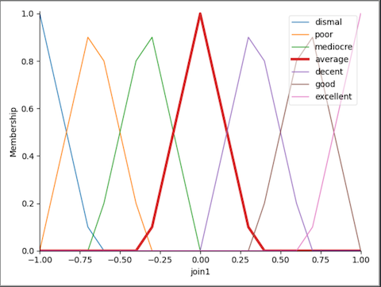
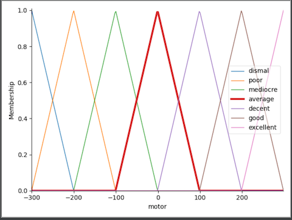

# Inverted Pendulum

## Simulation of inverted pendulum with PID controller and fuzzy controller


intsall:
- pygame
- box2d
- box2d-py
- scikit-fuzzy

four different control systems included:
- run Pendulum_PID.py for PID control loop
- run Pendulum_Fuzzy.py for fuzzy control loop 
- run Pendulum_Fuzzy_PID.py for combination of fuzzy and PID control loop (runs smoother)
- run Pendulum_Fuzzy_PID_advanced.py for combination of two fuzzy controls to keep the pendulum in the middle
___________________________________________________________________________________________
### PID control loop

PID control loop uses PID library from [PyConSys](https://github.com/mck-sbs/PyConSys)

Following PID parameters are used in this example:
```
self._pid_control = PIDControl(105, 83, 28)  # kp, ki, kd
```

keyboard commands:
- n: create new world
- m: manual mode
- a: automatic mode
___________________________________________________________________________________________
### fuzzy control loop
fuzzy control loop uses scikit-fuzzy

keyboard commands:
- n: create new world

Input fuzzy set:


Output fuuzy set:


Simple inference:
```
self.rule1 = ctrl.Rule(self.fuzz_pend1['dismal'], self.fuzz_motor['dismal'])
self.rule2 = ctrl.Rule(self.fuzz_pend1['poor'], self.fuzz_motor['poor'])
self.rule3 = ctrl.Rule(self.fuzz_pend1['mediocre'], self.fuzz_motor['mediocre'])
self.rule4 = ctrl.Rule(self.fuzz_pend1['average'], self.fuzz_motor['average'])
self.rule5 = ctrl.Rule(self.fuzz_pend1['decent'], self.fuzz_motor['decent'])
self.rule6 = ctrl.Rule(self.fuzz_pend1['good'], self.fuzz_motor['good'])
self.rule7 = ctrl.Rule(self.fuzz_pend1['excellent'], self.fuzz_motor['excellent'])
self.pendulum_ctrl = ctrl.ControlSystem([self.rule1, self.rule2, self.rule3, self.rule4, self.rule5, self.rule6, self.rule7])
```


Defuzzification:

___________________________________________________________________________________________
### PID-Fuzzy combination control loop
Combination of fuzzy ans PID control loop, to get the control loop smoother.
___________________________________________________________________________________________
### Combination of two fuzzy controls
This keeps the pendulum in the middle. 

First fuzzy
- input: angle and angle speed
- output: motor1

Second Fuzzy
- position and speed
- output motor2

motor = motor1 + motor2
___________________________________________________________________________________________

From the course "Mechatronische Systeme (Mechatronic Systems)", technical college SBS Herzogenaurach-Höchstadt.

___________________________________________________________________________________________

This Source Code Form is subject to the terms of the Mozilla Public
License, v. 2.0. If a copy of the MPL was not distributed with this
file, You can obtain one at https://mozilla.org/MPL/2.0/.

(c) 2020, Metin Karatas (m.karatas@sbs-herzogenaurach.de)

